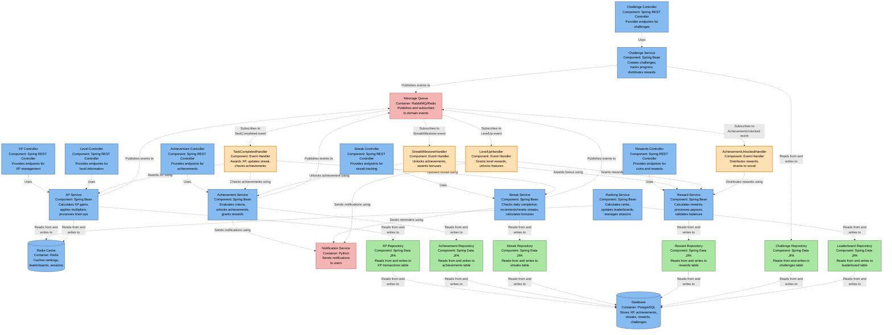

```mermaid
graph TB
    %% Styling
    classDef componentStyle fill:#85BBF0,stroke:#5D82A8,stroke-width:2px,color:#000
    classDef repositoryStyle fill:#A8E6A1,stroke:#6FA863,stroke-width:2px,color:#000
    classDef externalStyle fill:#F4B4B4,stroke:#C87D7D,stroke-width:2px,color:#000
    classDef databaseStyle fill:#85BBF0,stroke:#5D82A8,stroke-width:2px,color:#000
    classDef eventStyle fill:#FFE0B2,stroke:#F57C00,stroke-width:2px,color:#000

    %% External Systems
    DB[(Database<br/>Container: PostgreSQL<br/>Stores XP, achievements,<br/>streaks, rewards, challenges)]:::databaseStyle
    CACHE[(Redis Cache<br/>Container: Redis<br/>Caches rankings,<br/>leaderboards, sessions)]:::databaseStyle
    MQ[Message Queue<br/>Container: RabbitMQ/Redis<br/>Publishes and subscribes<br/>to domain events]:::externalStyle
    NOTIF[Notification Service<br/>Container: Python<br/>Sends notifications<br/>to users]:::externalStyle

    %% API Controllers Layer
    XP_CTRL[XP Controller<br/>Component: Spring REST Controller<br/>Provides endpoints for<br/>XP management]:::componentStyle
    ACH_CTRL[Achievement Controller<br/>Component: Spring REST Controller<br/>Provides endpoints for<br/>achievements]:::componentStyle
    STREAK_CTRL[Streak Controller<br/>Component: Spring REST Controller<br/>Provides endpoints for<br/>streak tracking]:::componentStyle
    LEVEL_CTRL[Level Controller<br/>Component: Spring REST Controller<br/>Provides endpoints for<br/>level information]:::componentStyle
    REWARD_CTRL[Rewards Controller<br/>Component: Spring REST Controller<br/>Provides endpoints for<br/>coins and rewards]:::componentStyle
    CHALLENGE_CTRL[Challenge Controller<br/>Component: Spring REST Controller<br/>Provides endpoints for<br/>challenges]:::componentStyle

    %% Business Logic Layer
    XP_SVC[XP Service<br/>Component: Spring Bean<br/>Calculates XP gains,<br/>applies multipliers,<br/>processes level ups]:::componentStyle
    ACH_SVC[Achievement Service<br/>Component: Spring Bean<br/>Evaluates criteria,<br/>unlocks achievements,<br/>grants rewards]:::componentStyle
    STREAK_SVC[Streak Service<br/>Component: Spring Bean<br/>Checks daily completion,<br/>increments/resets streaks,<br/>calculates bonuses]:::componentStyle
    REWARD_SVC[Reward Service<br/>Component: Spring Bean<br/>Calculates rewards,<br/>processes payouts,<br/>validates balances]:::componentStyle
    CHALLENGE_SVC[Challenge Service<br/>Component: Spring Bean<br/>Creates challenges,<br/>tracks progress,<br/>distributes rewards]:::componentStyle
    RANKING_SVC[Ranking Service<br/>Component: Spring Bean<br/>Calculates ranks,<br/>updates leaderboards,<br/>manages seasons]:::componentStyle

    %% Event Handlers
    TASK_HANDLER[TaskCompletedHandler<br/>Component: Event Handler<br/>Awards XP, updates streak,<br/>checks achievements]:::eventStyle
    STREAK_HANDLER[StreakMilestoneHandler<br/>Component: Event Handler<br/>Unlocks achievements,<br/>awards bonuses]:::eventStyle
    LEVEL_HANDLER[LevelUpHandler<br/>Component: Event Handler<br/>Grants level rewards,<br/>unlocks features]:::eventStyle
    ACH_HANDLER[AchievementUnlockedHandler<br/>Component: Event Handler<br/>Distributes rewards,<br/>shares to social]:::eventStyle

    %% Repository Layer
    XP_REPO[XP Repository<br/>Component: Spring Data JPA<br/>Reads from and writes to<br/>XP transactions table]:::repositoryStyle
    ACH_REPO[Achievement Repository<br/>Component: Spring Data JPA<br/>Reads from and writes to<br/>achievements table]:::repositoryStyle
    STREAK_REPO[Streak Repository<br/>Component: Spring Data JPA<br/>Reads from and writes to<br/>streaks table]:::repositoryStyle
    REWARD_REPO[Reward Repository<br/>Component: Spring Data JPA<br/>Reads from and writes to<br/>rewards table]:::repositoryStyle
    CHALLENGE_REPO[Challenge Repository<br/>Component: Spring Data JPA<br/>Reads from and writes to<br/>challenges table]:::repositoryStyle
    LEADERBOARD_REPO[Leaderboard Repository<br/>Component: Spring Data JPA<br/>Reads from and writes to<br/>leaderboard table]:::repositoryStyle

    %% Dependencies - Controllers to Services
    XP_CTRL -.->|Uses| XP_SVC
    ACH_CTRL -.->|Uses| ACH_SVC
    STREAK_CTRL -.->|Uses| STREAK_SVC
    LEVEL_CTRL -.->|Uses| XP_SVC
    REWARD_CTRL -.->|Uses| REWARD_SVC
    CHALLENGE_CTRL -.->|Uses| CHALLENGE_SVC

    %% Dependencies - Services to Repositories
    XP_SVC -.->|Reads from and<br/>writes to| XP_REPO
    ACH_SVC -.->|Reads from and<br/>writes to| ACH_REPO
    STREAK_SVC -.->|Reads from and<br/>writes to| STREAK_REPO
    REWARD_SVC -.->|Reads from and<br/>writes to| REWARD_REPO
    CHALLENGE_SVC -.->|Reads from and<br/>writes to| CHALLENGE_REPO
    RANKING_SVC -.->|Reads from and<br/>writes to| LEADERBOARD_REPO

    %% Dependencies - Services to Cache
    RANKING_SVC -.->|Reads from and<br/>writes to| CACHE
    XP_SVC -.->|Reads from and<br/>writes to| CACHE

    %% Dependencies - Services to Message Queue
    XP_SVC -.->|Publishes events to| MQ
    ACH_SVC -.->|Publishes events to| MQ
    STREAK_SVC -.->|Publishes events to| MQ
    CHALLENGE_SVC -.->|Publishes events to| MQ

    %% Dependencies - Event Handlers
    MQ -.->|Subscribes to<br/>TaskCompleted event| TASK_HANDLER
    MQ -.->|Subscribes to<br/>StreakMilestone event| STREAK_HANDLER
    MQ -.->|Subscribes to<br/>LevelUp event| LEVEL_HANDLER
    MQ -.->|Subscribes to<br/>AchievementUnlocked event| ACH_HANDLER

    %% Event Handlers to Services
    TASK_HANDLER -.->|Awards XP using| XP_SVC
    TASK_HANDLER -.->|Updates streak using| STREAK_SVC
    TASK_HANDLER -.->|Checks achievements using| ACH_SVC
    STREAK_HANDLER -.->|Unlocks achievement using| ACH_SVC
    STREAK_HANDLER -.->|Awards bonus using| REWARD_SVC
    LEVEL_HANDLER -.->|Grants rewards using| REWARD_SVC
    ACH_HANDLER -.->|Distributes rewards using| REWARD_SVC

    %% Repositories to Database
    XP_REPO -.->|Reads from and<br/>writes to| DB
    ACH_REPO -.->|Reads from and<br/>writes to| DB
    STREAK_REPO -.->|Reads from and<br/>writes to| DB
    REWARD_REPO -.->|Reads from and<br/>writes to| DB
    CHALLENGE_REPO -.->|Reads from and<br/>writes to| DB
    LEADERBOARD_REPO -.->|Reads from and<br/>writes to| DB

    %% Services to Notification Service
    ACH_SVC -.->|Sends notifications using| NOTIF
    STREAK_SVC -.->|Sends reminders using| NOTIF
    LEVEL_HANDLER -.->|Sends notifications using| NOTIF
```
