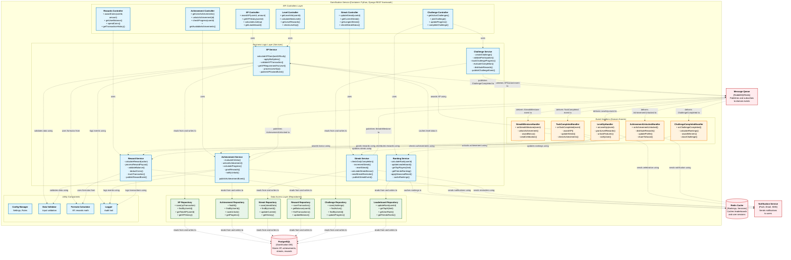

```mermaid
graph TB
    %% Styling
    classDef componentStyle fill:#e1f5fe,stroke:#0277bd,stroke-width:2px,color:#000
    classDef repositoryStyle fill:#e8f5e9,stroke:#2e7d32,stroke-width:2px,color:#000
    classDef externalStyle fill:#ffebee,stroke:#c62828,stroke-width:2px,color:#000
    classDef eventStyle fill:#fff3e0,stroke:#f57c00,stroke-width:2px,color:#000
    classDef sectionStyle fill:#fff,stroke:#0277bd,stroke-width:2px,color:#000
    classDef utilityStyle fill:#e3f2fd,stroke:#1565c0,stroke-width:2px,color:#000

    subgraph CONTAINER["Gamification Service [Container: Python, Django REST framework]"]
        
        subgraph API_LAYER["API Controllers Layer"]
            XP_CTRL["<b>XP Controller</b><br/>+ awardXP(userId, amount)<br/>+ getXPHistory(userId)<br/>+ calculateLevel(xp)<br/>+ getLeaderboard()"]:::componentStyle
            ACH_CTRL["<b>Achievement Controller</b><br/>+ getUserAchievements()<br/>+ unlockAchievement(id)<br/>+ checkProgress(userId)<br/>+ getAvailableAchievements()"]:::componentStyle
            STREAK_CTRL["<b>Streak Controller</b><br/>+ updateStreak(userId)<br/>+ getCurrentStreak()<br/>+ getLongestStreak()<br/>+ checkStreakStatus()"]:::componentStyle
            LEVEL_CTRL["<b>Level Controller</b><br/>+ getLevelInfo(userId)<br/>+ calculateNextLevel()<br/>+ getLevelRewards()<br/>+ checkLevelUp()"]:::componentStyle
            REWARD_CTRL["<b>Rewards Controller</b><br/>+ awardCoins(userId, amount)<br/>+ getUserBalance()<br/>+ spendCoins()<br/>+ getTransactionHistory()"]:::componentStyle
            CHALLENGE_CTRL["<b>Challenge Controller</b><br/>+ getActiveChallenges()<br/>+ joinChallenge()<br/>+ updateProgress()<br/>+ completeChallenge()"]:::componentStyle
        end

        subgraph BUSINESS_LAYER["Business Logic Layer (Services)"]
            XP_SVC["<b>XP Service</b><br/>- calculateXPGain(taskDifficulty)<br/>- applyMultipliers()<br/>- validateXPTransaction()<br/>- getXPRequirementForLevel()<br/>- processLevelUp()<br/>- publishXPGainedEvent()"]:::componentStyle
            ACH_SVC["<b>Achievement Service</b><br/>- evaluateCriteria()<br/>- unlockAchievement()<br/>- calculateProgress()<br/>- grantRewards()<br/>- notifyUnlock()<br/>- publishAchievementEvent()"]:::componentStyle
            STREAK_SVC["<b>Streak Service</b><br/>- checkDailyCompletion()<br/>- incrementStreak()<br/>- resetStreak()<br/>- calculateStreakBonus()<br/>- sendStreakReminder()<br/>- publishStreakEvent()"]:::componentStyle
            REWARD_SVC["<b>Reward Service</b><br/>- calculateReward(action)<br/>- processRewardPayout()<br/>- validateBalance()<br/>- deductCoins()<br/>- trackTransaction()<br/>- publishRewardEvent()"]:::componentStyle
            CHALLENGE_SVC["<b>Challenge Service</b><br/>- createChallenge()<br/>- validateParticipation()<br/>- trackChallengeProgress()<br/>- evaluateCompletion()<br/>- distributeRewards()<br/>- publishChallengeEvent()"]:::componentStyle
            RANKING_SVC["<b>Ranking Service</b><br/>- calculateRank(userId)<br/>- updateLeaderboard()<br/>- getTopPlayers(limit)<br/>- getFriendsRanking()<br/>- applySeasonalReset()<br/>- cacheRankings()"]:::componentStyle
        end

        subgraph EVENT_LAYER["Event Handlers (Domain Events)"]
            TASK_HANDLER["<b>TaskCompletedHandler</b><br/>+ onTaskCompleted(event)<br/>- awardXP()<br/>- updateStreak()<br/>- checkAchievements()"]:::eventStyle
            STREAK_HANDLER["<b>StreakMilestoneHandler</b><br/>+ onStreakMilestone(event)<br/>- unlockAchievement()<br/>- awardBonus()<br/>- sendCelebration()"]:::eventStyle
            LEVEL_HANDLER["<b>LevelUpHandler</b><br/>+ onLevelUp(event)<br/>- grantLevelRewards()<br/>- unlockFeatures()<br/>- notifyUser()"]:::eventStyle
            ACH_HANDLER["<b>AchievementUnlockedHandler</b><br/>+ onAchievementUnlocked()<br/>- distributeRewards()<br/>- updateProfile()<br/>- shareToSocial()"]:::eventStyle
            CHALLENGE_HANDLER["<b>ChallengeCompletedHandler</b><br/>+ onChallengeCompleted()<br/>- calculateRankings()<br/>- awardWinners()<br/>- closeChallenge()"]:::eventStyle
        end

        subgraph REPO_LAYER["Data Access Layer (Repositories)"]
            XP_REPO["<b>XP Repository</b><br/>+ save(xpTransaction)<br/>+ findByUserId()<br/>+ getTotalXP(userId)<br/>+ getXPHistory()"]:::repositoryStyle
            ACH_REPO["<b>Achievement Repository</b><br/>+ findAll()<br/>+ findByUserId()<br/>+ saveUnlock()<br/>+ getProgress()"]:::repositoryStyle
            STREAK_REPO["<b>Streak Repository</b><br/>+ save(streakData)<br/>+ findByUserId()<br/>+ updateCurrent()<br/>+ getHistory()"]:::repositoryStyle
            REWARD_REPO["<b>Reward Repository</b><br/>+ saveTransaction()<br/>+ getBalance(userId)<br/>+ findTransactions()<br/>+ updateBalance()"]:::repositoryStyle
            CHALLENGE_REPO["<b>Challenge Repository</b><br/>+ save(challenge)<br/>+ findActive()<br/>+ findByUserId()<br/>+ updateProgress()"]:::repositoryStyle
            LEADERBOARD_REPO["<b>Leaderboard Repository</b><br/>+ updateRank(userId)<br/>+ getTopN(limit)<br/>+ getUserRank()<br/>+ getFriendsRanks()"]:::repositoryStyle
        end

        subgraph UTILITY_LAYER["Utility Components"]
            CONFIG["<b>Config Manager</b><br/>Settings, Rules"]:::componentStyle
            VALIDATOR["<b>Data Validator</b><br/>Input validation"]:::componentStyle
            CALCULATOR["<b>Formula Calculator</b><br/>XP, rewards math"]:::componentStyle
            LOGGER["<b>Logger</b><br/>Audit trail"]:::componentStyle
        end
    end

    %% External Systems
    DB[("<b>PostgreSQL</b><br/>[Gamification DB]<br/>Stores XP, achievements,<br/>streaks, rewards")]:::externalStyle
    CACHE[("<b>Redis Cache</b><br/>[Rankings, Sessions]<br/>Caches leaderboards<br/>and user sessions")]:::externalStyle
    MQ["<b>Message Queue</b><br/>[RabbitMQ/Redis]<br/>Publishes and subscribes<br/>to domain events"]:::externalStyle
    NOTIF["<b>Notification Service</b><br/>[Push, Email, SMS]<br/>Sends notifications<br/>to users"]:::externalStyle

    %% Controllers to Services Dependencies
    XP_CTRL -.->|uses| XP_SVC
    ACH_CTRL -.->|uses| ACH_SVC
    STREAK_CTRL -.->|uses| STREAK_SVC
    LEVEL_CTRL -.->|uses| XP_SVC
    REWARD_CTRL -.->|uses| REWARD_SVC
    CHALLENGE_CTRL -.->|uses| CHALLENGE_SVC
    CHALLENGE_CTRL -.->|uses| RANKING_SVC

    %% Services to Repositories Dependencies
    XP_SVC -.->|reads from and writes to| XP_REPO
    ACH_SVC -.->|reads from and writes to| ACH_REPO
    STREAK_SVC -.->|reads from and writes to| STREAK_REPO
    REWARD_SVC -.->|reads from and writes to| REWARD_REPO
    CHALLENGE_SVC -.->|reads from and writes to| CHALLENGE_REPO
    RANKING_SVC -.->|reads from and writes to| LEADERBOARD_REPO

    %% Services to Cache
    RANKING_SVC -.->|caches rankings in| CACHE
    XP_SVC -.->|caches level data in| CACHE

    %% Services to Message Queue (Publishing Events)
    XP_SVC -.->|publishes XPGained event to| MQ
    ACH_SVC -.->|publishes AchievementUnlocked to| MQ
    STREAK_SVC -.->|publishes StreakMilestone to| MQ
    CHALLENGE_SVC -.->|publishes ChallengeCompleted to| MQ

    %% Message Queue to Event Handlers (Subscribing)
    MQ -.->|delivers TaskCompleted event to| TASK_HANDLER
    MQ -.->|delivers StreakMilestone event to| STREAK_HANDLER
    MQ -.->|delivers LevelUp event to| LEVEL_HANDLER
    MQ -.->|delivers AchievementUnlocked to| ACH_HANDLER
    MQ -.->|delivers ChallengeCompleted to| CHALLENGE_HANDLER

    %% Event Handlers to Services
    TASK_HANDLER -.->|awards XP using| XP_SVC
    TASK_HANDLER -.->|updates streak using| STREAK_SVC
    TASK_HANDLER -.->|checks achievements using| ACH_SVC
    STREAK_HANDLER -.->|unlocks achievement using| ACH_SVC
    STREAK_HANDLER -.->|awards bonus using| REWARD_SVC
    LEVEL_HANDLER -.->|grants rewards using| REWARD_SVC
    ACH_HANDLER -.->|distributes rewards using| REWARD_SVC
    CHALLENGE_HANDLER -.->|updates rankings using| RANKING_SVC

    %% Repositories to Database
    XP_REPO -.->|reads from and writes to| DB
    ACH_REPO -.->|reads from and writes to| DB
    STREAK_REPO -.->|reads from and writes to| DB
    REWARD_REPO -.->|reads from and writes to| DB
    CHALLENGE_REPO -.->|reads from and writes to| DB
    LEADERBOARD_REPO -.->|reads from and writes to| DB

    %% Services to Notification Service
    ACH_SVC -.->|sends notifications using| NOTIF
    STREAK_SVC -.->|sends reminders using| NOTIF
    LEVEL_HANDLER -.->|sends celebration using| NOTIF
    ACH_HANDLER -.->|sends notification using| NOTIF

    %% Utilities Usage
    XP_SVC -.->|uses formulas from| CALCULATOR
    REWARD_SVC -.->|uses formulas from| CALCULATOR
    XP_SVC -.->|validates data using| VALIDATOR
    ACH_SVC -.->|validates data using| VALIDATOR
    XP_SVC -.->|logs events using| LOGGER
    ACH_SVC -.->|logs events using| LOGGER
    REWARD_SVC -.->|logs transactions using| LOGGER
```
